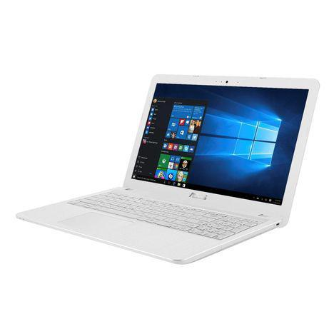

# Asus-VivoBook-R541U-Hackintosh

#### *Leggilo in un'altra lingua: [Italiano](README.md).* :it:

# Italian Repository 🇮🇹
## macOS Big Sur/Monterey successfully installed on ASUS Vivobook R541U

# Specifiche:

| Components.      | Model.                                 |
| ---------------- | -------------------------------------- |
| Notebook         | ASUS Vivobook R541U (BIOS 310)         |
| CPU              | Intel Core i3 6006U                    | 
| iGPU             | Intel® HD Graphics 520                 |
| Audio            | Realtek ALC256                         |
| LAN              | Realtek RTL810xE                       |
| RAM              | 8 GB DDR4 2133 Mhz (indicated by macOS)|
| SSD              | Samsung 860 Evo 500gb                  |
| SMBIOS           | MacBookPro13,1                         |
| Bootloader       | OpenCore 0.7.4                         |

## NOTES:
I leave you the EFI with SSDT, it would make no sense to leave you the one with DSDT patched because it would not work on your PC.
Therefore the only thing that won't work will be the FN key combo (FN + F1, FN + F2 etc.)
In post installation write in the HackintoshLife group that I leave you at the bottom of the page to extract and patch your DSDT.
Kexts updated to the latest versions.

## If you want to install macOS Monterey Beta 8:
~~I leave you the config.plist renamed to configbeta8.plist ready to use ONLY to download and install the update. At the end of the update you have to delete it and put back the original config.plist. It is advisable to disconnect the Hackintosh from the Apple ID before temporarily replacing the config.plist, alternatively use the kexts RestrictEvents.~~

This update issue has been fixed with OpenCore 0.7.4. Now you can update without RestrictEvents.kexts and without changing config.plist

# BIOS Settings (310):

Before the setting, load default settings

## Enable:
- Intel Virtualizzation Technology
- DVMT Pre Allocated --> 64MB

## Disable:
- VT-d
- Fast Boot
- CSM Support
- Secure Boot Control

# Note BIOS:
If you find the VT-d option in your BIOS you have to disable it and uncheck DisableIoMapper in Kernel, in the config.plist

I have already added 2 tools:
- ControlMsrE2
- modGRUBShell

The first checks the status of CFG Lock, the second could be useful for unlocking CFG Lock and other parameters not visible in the BIOS interface.

# Devices Screenshots

# What works and what doesn't:
- [x] Intel® HD Graphics 520 iGPU
- [x] Realtek ALC256 Internal Output
- [x] Realtek ALC256 HDMI Audio Output
- [x] USB Ports
- [x] Realtek RTL810xE
- [x] NVRAM
- [x] Boot Windows By OpenCore
- [ ] NVIDIA® GeForce® 920MX
- [ ] SD Card Reader (it might work for some)
- [ ] WiFi + Bluetooth (you can replace the card with a compatible one)

# Info SSDT ASUS Vivobook R541U

## Credits

- [Acidanthera](https://github.com/acidanthera) for OpenCore Bootloader
- [Apple](https://apple.com) for macOS;
- [HackintoshLifeIT](https://github.com/Hackintoshlifeit) Support group pre and post install
- [Dortania](https://github.com/dortania) for OpenCore Guides

# If you need help please contact us on [Telegram](https://t.me/HackintoshLife_it)
